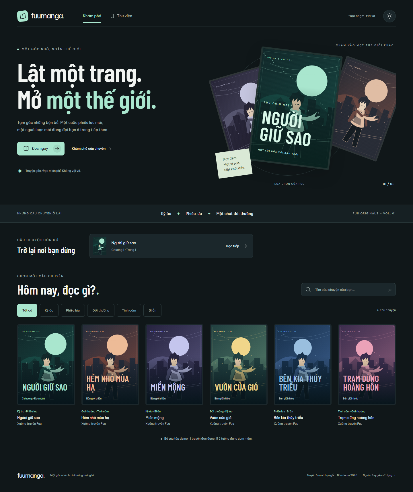
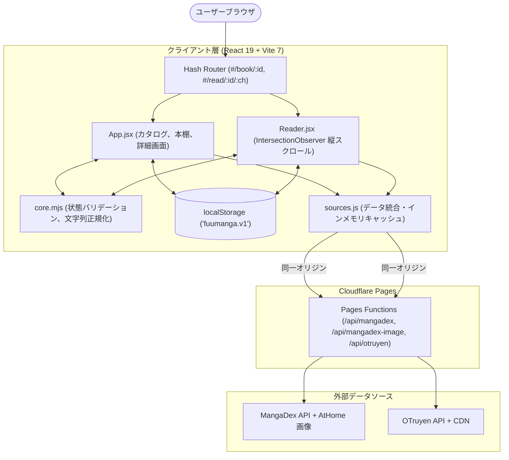
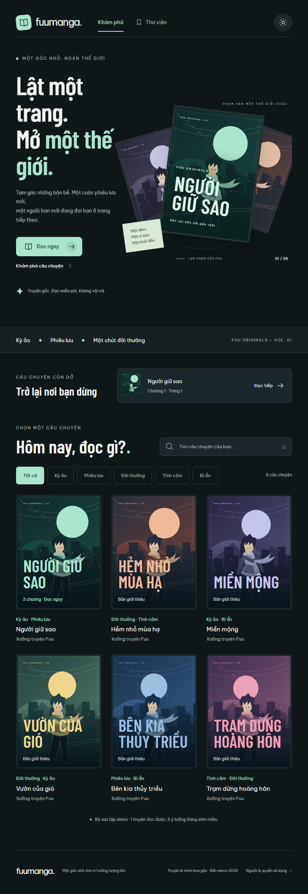
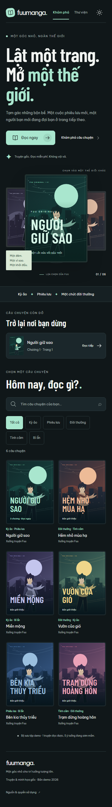

[English](./README.md) | **日本語**

<div align="center">
  <h1>FuuManga</h1>
  <p><strong>ベトナム語翻訳漫画の公開 API を統合し、ログイン不要・完全クライアントサイドの状態永続化とレスポンシブな閲覧体験を提供する軽量 Web 漫画リーダー。</strong></p>
  <p>
    <a href="https://github.com/epauengi/FuuManga">リポジトリ</a>
  </p>
  <p>
    
    
    
    
  </p>
</div>

<picture>
  <source media="(prefers-color-scheme: dark)" srcset="./tests/evidence/home-dark-1440.png">
  <source media="(prefers-color-scheme: light)" srcset="./tests/evidence/home-light-1440.png">
  
</picture>

## 概要

FuuManga は、デスクトップ・タブレット・スマートフォンの各種デバイスで快適に漫画を閲覧できるクライアントレンダリング型の Web アプリケーションです。外部の公開 API（MangaDex および OTruyen）からカタログおよび章データを取得・統合し、ユーザー登録や不要なトラッキングを一切排除したミニマルな読書環境を実現しています。

閲覧履歴、ブックマークした作品、テーマ設定はすべてクライアントの `localStorage` 上で安全に検証・管理され、外部サーバーへ個人データを送信しません。

---

## 開発背景・課題

一般的なオンライン漫画閲覧サービスでは、過剰な広告表示、強制的な会員登録、過度に肥大化したクライアントバンドル、モバイル端末での表示崩れなどの課題が見られます。FuuManga はこれらの課題を解決し、以下の技術的目標を実証するために設計・開発されました。

1. **無駄を削ぎ落とした設計**: コンテンツ閲覧とユーザーのプライバシー保護を最優先にしたアーキテクチャ。
2. **堅牢なクライアント状態管理**: ブラウザのプライベートモードや容量超過、破損データが発生しても停止しないフォールバック設計。
3. **ベトナム語特有の文字処理**: 声調記号や合成 Unicode（`NFD`）、特殊文字（`đ`/`Đ`）を考慮した検索正規化。
4. **依存ライブラリの最小化**: 重厚な UI フレームワークに依存せず、Vanilla CSS とネイティブフォント読み込みによる高速な初期表示。

---

## 主な機能

- **複数データソースの統合取得**: MangaDex と OTruyen から並行して作品データを取得し、接頭辞（`md-*`, `ot-*`）を用いたルーティングとメモリキャッシュで管理。
- **声調記号を無視できるベトナム語検索・ジャンル絞り込み**: 合成 Unicode の分解（`NFD`）と特殊文字変換により、大文字・小文字・記号の有無を問わないインクリメンタル検索を実現。
- **縦スクロール連続リーダー**: `IntersectionObserver` による表示中ページ検知と、正確な読書位置の自動同期・復元。
- **プライバシー重視のライブラリ・履歴管理**: 登録不要で作品をお気に入り保存し、前回の読書位置（章・ページ番号）から即座に再開可能（スキーマ検証・重複排除済み）。
- **ダーク / ライトテーマ切り替え**: CSS カスタムプロパティ（CSS 変数）による即時テーマ切り替えとシステム設定連動。
- **アクセシビリティとモバイル対応**: スキップリンク、キーボード操作用の `:focus-visible` スタイリング、`prefers-reduced-motion`（視覚効果の低減）対応。

---

## 技術スタック

| カテゴリ | 採用技術 | 用途 | 選定理由 |
| --- | --- | --- | --- |
| **Frontend** | React 19 (`^19.1.1`) | UI コンポーネントおよび状態管理 | 宣言的 UI 設計と最新 Hooks API の活用 |
| **Build Tool** | Vite 7 (`^7.1.4`) | 開発サーバーおよび ESM 本番ビルド | 高速な HMR、最小限のバンドルサイズ |
| **Edge Runtime** | Cloudflare Pages Functions | MangaDex・OTruyen API の同一オリジンプロキシ | 専用サーバーなしで上流 CORS と MangaDex のホットリンク要件に対応 |
| **Styling** | Vanilla CSS (CSS Variables) | レイアウト、流体タイポグラフィ、テーマ | ランタイムオーバーヘッドの排除、端末幅に応じた細やかな表示制御 |
| **Typography** | Be Vietnam Pro / Barlow Condensed | タイトルおよび本文テキスト表示 | 自前ホストフォント（`font-display: swap`）による表示安定化 |
| **Testing** | Node.js Test Runner (`node:test`) | コアロジック（状態・ルーティング）の単体テスト | 外部テストライブラリ不要で高速に実行できるネイティブ機能 |
| **E2E Testing** | Playwright (Python) | 画面サイズ別回帰テスト・アクセシビリティ検証 | 複数 viewport、ストレージ障害、ユーザーフローの自動検証 |
| **APIs** | MangaDex API / OTruyen API | カタログおよび章画像のデータ配信元 | 公開されているベトナム語漫画エコシステムとの連携 |

---

## アーキテクチャ



---

## 技術的な工夫

### 1. ベトナム語の表記揺れを吸収する検索正規化

**課題**  
ベトナム語には複雑な声調記号、Unicode の合成形式の違い（`NFD` と `NFC`）、および独自の文字（`đ`/`Đ`）が存在します。単純な `toLowerCase().includes()` による文字列比較では、記号なしで入力された検索や入力方式の違いによる不一致が発生します。

**対応**  
外部ライブラリを追加せず、[`src/core.mjs`](./src/core.mjs) に軽量な正規化処理を実装しました。
```javascript
export const normalize = value =>
  String(value)
    .normalize('NFD')
    .replace(/[̀-ͯ]/g, '')
    .replace(/đ/g, 'd')
    .replace(/Đ/g, 'D')
    .toLowerCase()
    .trim();
```

**結果**  
大文字・小文字、声調記号の有無、特殊文字の違いを吸収し、快適なインクリメンタル検索を実現しました。単体テスト（`tests/core.test.mjs`）で網羅的に検証しています。

---

### 2. クライアントストレージの堅牢化とプライバシー保護

**課題**  
ブラウザのプライベートブラウジング設定、Cookie/Storage ブロック、容量制限、あるいは壊れた JSON 文字列の読み込みによって、`localStorage` のアクセス時に例外が発生し、アプリ全体がクラッシュするリスクがあります。

**対応**  
すべてのストレージ読み書き処理を [`src/core.mjs`](./src/core.mjs) のバリデーション層（`validateState`, `loadState`, `saveState`）でカプセル化しました。
- 型チェック、章番号の境界値、および ID パターン（`/^(md-[a-f0-9-]+|ot-[a-z0-9-]+)$/`）を検証。
- 保存済みリストの重複を自動排除。
- ストレージ書き込み拒否時にはインメモリ状態へ安全にフォールバックし、操作を妨げない通知バナーを表示。

**結果**  
ストレージが無効化または破損した環境でも画面がクラッシュせず、そのセッション中は読書や機能利用を継続できるようにしました。Playwright を用いた障害注入テスト（`tests/browser.py`）でも動作を確認しています。

---

### 3. IntersectionObserver による読書位置の精密追従

**課題**  
縦スクロール型の漫画リーダーにおいて、大量の高解像度画像をスクロールする際に `window.onscroll` で位置計算を行うと、メインスレッドの負荷が増大し、フレーム落ちや誤ったページ保存が発生します。

**対応**  
[`src/Reader.jsx`](./src/Reader.jsx) において、非対称なマージンを指定した `IntersectionObserver` を採用しました。
```javascript
const observer = new IntersectionObserver(entries => {
  for (const entry of entries) {
    if (entry.isIntersecting) {
      const next = Number(entry.target.dataset.page);
      setPage(next);
      progressCallback.current(book.id, chapterId, next, book.title, currentChapter.title);
    }
  }
}, { rootMargin: '-15% 0px -35% 0px', threshold: 0.15 });
```
再開時には `requestAnimationFrame` と `scrollIntoView({ block: 'start', behavior: 'instant' })` を組み合わせ、対象ページへ即時スクロールします。

**結果**  
スムーズなスクロール体験を保ちながら、リロード時にも前回の閲覧位置を正確に復元できるようにしました。

---

### 4. 複数 API の並行集約と安全なフォールバック

**課題**  
外部の漫画配信 API はそれぞれ異なるレスポンス構造、レートリミット、CORS 制約を持っています。1 つの API がダウンした際に、アプリ全体が停止してはなりません。

**対応**  
- [`src/sources.js`](./src/sources.js) で `Promise.allSettled` を利用し、並行してカタログを取得。
- 作品 ID にプレフィックス（`md-` / `ot-`）を付与し、ルーティングとデータ取得先を明確に分離。
- インメモリの `Map` キャッシュにより、同一作品の再アクセス時の不要な通信を抑制。
- 画像取得失敗時の `<Artwork />` 代替表示と、エラー時の案内 UI を整備。

**結果**  
一部の外部サーバーで障害が発生した場合でも、正常なカタログを維持し、失敗したプロバイダーと再試行操作を表示します。MangaDex と OTruyen の API リクエストは限定された同一オリジンの Cloudflare Pages Function を経由し、MangaDex の表紙・章画像も同一オリジンの画像プロキシを経由します。

---

## 技術選定・設計判断

### Vanilla CSS の採用（CSS フレームワーク不採用）

- **判断**: Tailwind CSS や CSS-in-JS を採用せず、ネイティブ CSS 変数と `clamp()` を活用した Vanilla CSS で実装。
- **理由**: モバイルでの漫画閲覧体験において、JS バンドルサイズとスタイル再計算コストを極小化するため。`document.documentElement.dataset.theme` を切り替えるだけで瞬時にテーマ変更が反映されます。
- **トレードオフ**: クラス命名規則やスタイル管理を自前で維持する必要があります。

### Node.js ネイティブテストランナー (`node:test`)

- **判断**: Jest や Vitest を追加せず、Node.js 組み込みの `node:test` および `node:assert/strict` を採用。
- **理由**: URL 解析や文字列正規化、状態バリデーションなどのコアロジックを、追加依存なし・100ms 未満の超高速で検証するため。
- **トレードオフ**: DOM モック機能は含まれないため、ブラウザ固有の動作検証は Playwright で補完しています。

### クライアントサイド Hash ルーティング (`#/`)

- **判断**: History API の代わりに Hash ルーティング（`#/book/:id`, `#/read/:id/:chapter`, `#/library`）を採用。
- **理由**: Cloudflare Pages Functions が `/api/*` のみを処理する一方、アプリケーションのナビゲーションをサーバー側リライトから独立させるため。
- **トレードオフ**: URL に `#` が含まれます。MangaDex は同一オリジンプロキシを要求するため、静的ホスト単体ではライブコンテンツを提供できません。

---

## UI / UX・アクセシビリティ

- **レスポンシブ検証**: 375px（モバイル）、768px（タブレット）、1440px（デスクトップ）の主要幅において横スクロールが発生しないこと（`scrollWidth <= innerWidth`）を自動テストで確認済み。
- **アニメーション低減対応**: `@media (prefers-reduced-motion: reduce)` を検知し、装飾アニメーションや回転エフェクトを自動停止。
- **キーボードナビゲーション**: メインコンテンツへ即座に移動できる `.skip-link`、および対話要素に対する `:focus-visible` アウトラインを完備。
- **スクリーンリーダー配慮**: `aria-pressed`、`aria-label`、`aria-current="page"`、`role="status"` などのセマンティック属性を適切に付与。

### レスポンシブ表示ギャラリー

| デスクトップ (1440px) | タブレット (768px) | スマートフォン (375px) |
| :---: | :---: | :---: |
|  |  |  |

---

## オンラインで読む

[fuumanga.vercel.app](https://fuumanga.vercel.app) を開けば、FuuManga をすぐに閲覧できます。ダウンロード、アカウント登録、セットアップは不要です。

カタログと章は外部プロバイダーから提供されるため、一時的な障害で利用できる作品が限られる場合があります。その場合、アプリ内に再試行操作が表示されます。

---

## ライセンス・著作権表示

- 本アプリケーションのソースコードは、ポートフォリオおよび学習目的で公開されています。
- 各種フォント（`Be Vietnam Pro`, `Barlow Condensed`）および画像アセットのライセンスは [`public/fonts/`](./public/fonts/) および [`public/art/`](./public/art/) に記載されています。
- 各漫画作品の著作権、書影、および翻訳データの権利は、原著作者・出版社・各翻訳グループに帰属します。
- 本番リーダーでは MangaDex と該当する翻訳グループのクレジット、コンテンツ削除要求の尊重、および最新の上流規約への準拠が必要です。プロキシはブラウザ通信だけを解決し、これらの義務を代替しません。
