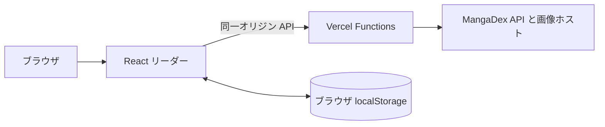

[English](./README.md) | **日本語**

<div align="center">
  <h1>FuuManga</h1>
  <p><strong>MangaDex を利用した軽量なベトナム語漫画リーダー。</strong></p>
  <p><a href="https://fuumanga.vercel.app">オンラインで読む</a> · <a href="https://github.com/epauengi/FuuManga">リポジトリ</a></p>
</div>

## オンラインで読む

[fuumanga.vercel.app](https://fuumanga.vercel.app) を開けば、アカウント登録、ダウンロード、セットアップなしですぐに閲覧できます。

## 主な機能

- **MangaDex 専用カタログ** — ベトナム語翻訳作品と章を、単一の維持されたデータソースから取得します。
- **ベトナム語検索** — 声調記号、Unicode 正規化、`đ`/`Đ` の違いを吸収します。
- **縦スクロールリーダー** — 遅延読み込み、読書位置保存、章移動に対応します。
- **プライベートな本棚** — 保存作品、履歴、テーマ設定はブラウザの `localStorage` にのみ保存されます。
- **レスポンシブ対応** — キーボード操作、動きを減らす設定、ダーク/ライトテーマ、モバイルからデスクトップまでのレイアウトを備えます。

## 読書の仕組み



Vercel プロキシにより、MangaDex API と画像リクエストを同一オリジンで処理します。`GET`/`HEAD` のみを許可し、固定された MangaDex API ホスト、レスポンスヘッダーの制限、有効な MangaDex 画像 URL のみを採用しています。

カタログと章の利用可否は MangaDex の稼働状況に依存します。上流の応答に失敗した場合も、リーダーには再試行操作が表示されます。

## 技術構成

| 領域 | 採用技術 |
| --- | --- |
| リーダー | React 19 + Vite 7 |
| スタイリング | Vanilla CSS variables |
| サーバー | Vercel Functions |
| コンテンツ | MangaDex API と AtHome 画像 |
| 永続化 | ブラウザ `localStorage` |

## デプロイ時の注意

Vercel の Preview と Production には、サーバー専用の `MANGADEX_USER_AGENT` 環境変数が必要です。`VITE_*` として公開しないでください。

```text
MANGADEX_USER_AGENT=FuuManga/1.0 (+https://github.com/epauengi/FuuManga)
```

## 帰属表示

漫画のメタデータ、表紙、翻訳章の権利は原著作者、出版社、翻訳グループに帰属します。本番リーダーでは MangaDex の規約を遵守し、適切な帰属表示とコンテンツ削除要求への対応が必要です。
