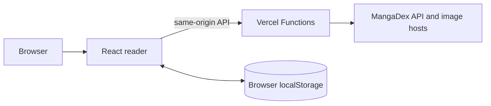

**English** | [日本語](./README.ja.md)

<div align="center">
  <h1>FuuManga</h1>
  <p><strong>A lightweight Vietnamese manga reader powered by MangaDex.</strong></p>
  <p><a href="https://fuumanga.vercel.app">Read online</a> · <a href="https://github.com/epauengi/FuuManga">Repository</a></p>
</div>

## Read online

Open [fuumanga.vercel.app](https://fuumanga.vercel.app). No account, download, or setup is required.

## What it offers

- **MangaDex-only catalog** — one maintained source for Vietnamese-translated titles and chapters.
- **Vietnamese-friendly search** — ignores accents, Unicode composition differences, and `đ`/`Đ` variations.
- **Continuous reader** — lazy-loaded vertical pages, saved reading position, and chapter navigation.
- **Private library** — saved titles, history, and theme stay in the browser’s `localStorage`.
- **Responsive access** — keyboard navigation, reduced-motion support, dark/light themes, and layouts for phone through desktop.

## How reading works



The Vercel proxy keeps MangaDex API and image requests same-origin. It accepts only `GET`/`HEAD`, uses a fixed MangaDex API host, filters forwarded response headers, and permits only valid MangaDex image URLs.

Live catalog and chapter availability depends on MangaDex. The reader keeps retry actions available when an upstream response fails.

## Technology

| Area | Choice |
| --- | --- |
| Reader | React 19 + Vite 7 |
| Styling | Vanilla CSS variables |
| Server | Vercel Functions |
| Content | MangaDex API and AtHome images |
| Persistence | Browser `localStorage` |

## Deployment note

The Vercel project needs a server-only `MANGADEX_USER_AGENT` environment variable in Preview and Production. Do **not** expose it as `VITE_*`.

```text
MANGADEX_USER_AGENT=FuuManga/1.0 (+https://github.com/epauengi/FuuManga)
```

## Attribution

Manga metadata, covers, and translated chapters belong to their original authors, publishers, and scanlation groups. A production reader must follow MangaDex terms, give appropriate attribution, and honor content-removal requests.
