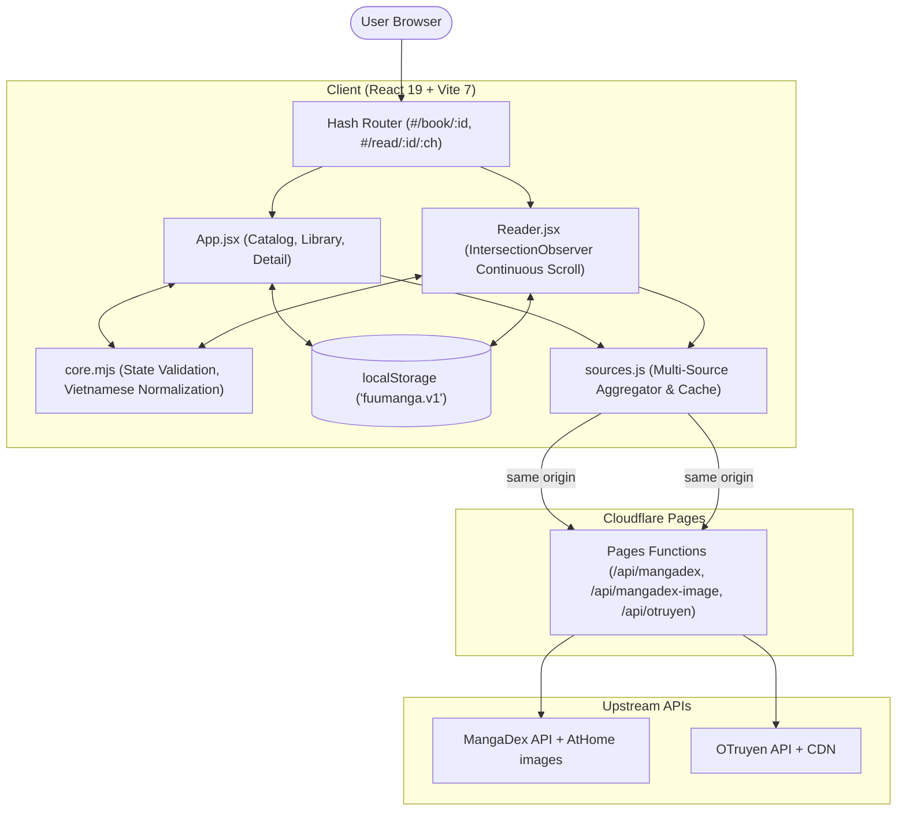

**English** | [日本語](./README.ja.md)

<div align="center">
  <h1>FuuManga</h1>
  <p><strong>Lightweight, privacy-first web manga reader aggregating live Vietnamese translations with zero authentication required, client-side reading persistence, and responsive reading UX.</strong></p>
  <p>
    <a href="https://github.com/epauengi/FuuManga">Repository</a>
  </p>
  <p>
    
    
    
    
  </p>
</div>

<picture>
  <source media="(prefers-color-scheme: dark)" srcset="./tests/evidence/home-dark-1440.png">
  <source media="(prefers-color-scheme: light)" srcset="./tests/evidence/home-light-1440.png">
  
</picture>

## Overview

FuuManga is a client-rendered manga web application designed for seamless reading across desktop, tablet, and mobile devices. It aggregates catalogs and chapter data from public upstream sources (MangaDex and OTruyen) into a unified, distraction-free reading experience without requiring user accounts or third-party tracking.

Reading history, bookmarked titles, and theme preferences are stored exclusively on the user's device using sanitized `localStorage`.

---

## Motivation

Many online reading platforms suffer from intrusive advertisements, forced registration flows, heavy client bundles, and broken navigation on mobile viewports. FuuManga was built to demonstrate:

1. **Clean Product Architecture**: A focused, zero-bloat manga reader prioritizing content delivery and user privacy.
2. **Resilient Client State**: Graceful degradation when browser storage is corrupted, restricted, or quota-exceeded.
3. **Robust Text Processing**: Diacritic-insensitive search and normalization tailored for Vietnamese typography.
4. **Performance without Heavy Tooling**: Fast first-contentful paint achieved through Vanilla CSS, native font loading, and zero unnecessary runtime dependencies.

---

## Key Features

- **Multi-Source Catalog Aggregation**: Concurrently fetches titles from MangaDex and OTruyen with in-memory caching and prefix-isolated routing (`md-*`, `ot-*`).
- **Diacritic-Insensitive Search & Genre Filter**: Real-time Vietnamese search supporting decomposed Unicode (`NFD`), tonal accents, and special characters (`đ`/`Đ`).
- **Vertical Continuous Reader**: Scroll-based chapter reading powered by `IntersectionObserver` for accurate active-page tracking and auto-saving reading position.
- **Privacy-First Library & History**: Save favorite series and resume reading from the exact chapter and page; 100% client-side with schema validation and deduplication.
- **Adaptive Dark / Light Themes**: Dual color themes implemented via CSS variables with system preference defaults and instant manual toggle.
- **Accessibility & Mobile-First Layout**: Semantic landmarks, keyboard `:focus-visible` styling, skip-to-content navigation, and full compliance with `prefers-reduced-motion`.

---

## Tech Stack

| Category | Technology | Purpose | Reason |
| --- | --- | --- | --- |
| **Frontend** | React 19 (`^19.1.1`) | UI component hierarchy and state management | Declarative rendering and hooks architecture |
| **Build Tool** | Vite 7 (`^7.1.4`) | Development server and ESM production bundler | Instant HMR and minimal build footprint |
| **Edge runtime** | Cloudflare Pages Functions | Same-origin MangaDex and OTruyen API proxy | Meets upstream CORS and MangaDex hotlink requirements without a dedicated server |
| **Styling** | Vanilla CSS (CSS Variables) | Layout, fluid typography, dark/light themes | Zero runtime CSS-in-JS overhead; full control over responsive layouts |
| **Typography** | Be Vietnam Pro & Barlow Condensed | Display and body text rendering | Tailored typography with native `@font-face` and `font-display: swap` |
| **Testing** | Node.js Test Runner (`node:test`) | Unit testing core state and routing logic | Zero extra test dependencies; fast native execution |
| **E2E Testing** | Playwright (Python runner) | Cross-viewport regression and accessibility testing | Validates multi-viewport responsiveness, storage blocking, and user flows |
| **APIs** | MangaDex API & OTruyen API | Remote catalog and chapter image delivery | Live Vietnamese translation ecosystem integration |

---

## Architecture



---

## Technical Highlights

### 1. Diacritic-Insensitive Vietnamese Search

**Problem**  
Vietnamese text incorporates complex tone marks, decomposed Unicode accents (`NFD` vs `NFC`), and unique consonants like `đ`/`Đ`. Standard string matching (`toLowerCase().includes()`) causes valid search terms to fail when users type without accents or with differing IME outputs.

**Approach**  
Implemented an efficient, zero-dependency normalization pipeline in [`src/core.mjs`](./src/core.mjs):
```javascript
export const normalize = value =>
  String(value)
    .normalize('NFD')
    .replace(/[̀-ͯ]/g, '')
    .replace(/đ/g, 'd')
    .replace(/Đ/g, 'D')
    .toLowerCase()
    .trim();
```

**Result**  
Users can search in upper case, lower case, non-accented Vietnamese, or formal accented Vietnamese interchangeably without query dropouts. Verified via unit tests (`tests/core.test.mjs`).

---

### 2. Resilient Client-Side State & Privacy-Preserving Persistence

**Problem**  
Relying naively on `localStorage` frequently breaks in production environments due to Private Browsing restrictions, quota exhaustion, or corrupted JSON data. A single unhandled exception during `JSON.parse` will crash the entire application.

**Approach**  
Wrapped all storage read/write operations with schema validation and error boundaries in [`src/core.mjs`](./src/core.mjs):
- Validates data types, chapter bounds, and book ID formats (`/^(md-[a-f0-9-]+|ot-[a-z0-9-]+)$/`).
- Automatically deduplicates saved collections.
- Catches browser storage exceptions and gracefully falls back to an in-memory session state, displaying a non-blocking user alert banner instead of crashing.

**Result**  
The application remains completely functional even when storage is blocked or corrupt. Verified through both unit tests and Playwright automated fault-injection scripts (`tests/browser.py`).

---

### 3. Continuous Reading Position Sync with IntersectionObserver

**Problem**  
In continuous vertical reading modes with multiple high-resolution images, tracking scroll position via window scroll events introduces render lag, layout thrashing, and inaccurate chapter/page progress calculation.

**Approach**  
Implemented an `IntersectionObserver` configuration inside [`src/Reader.jsx`](./src/Reader.jsx) with asymmetrical root margins:
```javascript
const observer = new IntersectionObserver(entries => {
  for (const entry of entries) {
    if (entry.isIntersecting) {
      const next = Number(entry.target.dataset.page);
      setPage(next);
      progressCallback.current(book.id, chapterId, next, book.title, currentChapter.title);
    }
  }
}, { rootMargin: '-15% 0px -35% 0px', threshold: 0.15 });
```
Combined with `requestAnimationFrame` and `scrollIntoView({ block: 'start', behavior: 'instant' })` on resume.

**Result**  
Smooth scrolling without frame drops, instant page restoration on browser refresh, and continuous reading progress updates saved to history.

---

### 4. Dual-Source API Aggregation with Safe Fallbacks

**Problem**  
External upstream manga APIs have different rate limits, response structures, and CORS policies. If one upstream provider experiences downtime, the entire application should not fail.

**Approach**  
- Managed parallel requests using `Promise.allSettled` in [`src/sources.js`](./src/sources.js).
- Prefixed all book IDs (`md-*` vs `ot-*`) to ensure deterministic routing and data source dispatch.
- Implemented an in-memory `Map` cache to prevent redundant network requests when switching between reader, detail, and catalog views.
- Added `<Artwork />` fallback placeholders and error states when remote chapter servers fail to respond.

**Result**  
Partial upstream outages preserve the healthy catalog and identify the failed provider with a retry action. MangaDex and OTruyen API requests use narrow same-origin Cloudflare Pages Functions; MangaDex covers and chapter images use the same-origin image proxy.

---

## Engineering Decisions

### Vanilla CSS vs CSS-in-JS / Utility Frameworks

- **Decision**: Used pure CSS with CSS custom properties (`--bg`, `--accent`, `--surface`, `--line`) and fluid layouts (`clamp()`).
- **Rationale**: Manga readers require minimal JavaScript footprint on mobile devices. Vanilla CSS eliminated extra bundle weight, prevented runtime style recalculations, and simplified theme switching via `document.documentElement.dataset.theme`.
- **Trade-off**: Requires manual maintenance of class naming conventions without utility autocomplete.

### Native Node.js Test Runner (`node:test`)

- **Decision**: Built unit tests using Node's built-in `node:test` and `node:assert/strict`.
- **Rationale**: Evaluated core business logic (URL parsing, state sanitation, diacritics removal) without installing extra test dependencies (e.g., Jest, Vitest). Keeps `devDependencies` minimal and execution under 100ms.
- **Trade-off**: Does not provide browser DOM mocking out of the box; browser behaviors are verified separately via Playwright.

### Client-Side Hash Routing (`#/`)

- **Decision**: Adopted hash-based routing (`#/book/:id`, `#/read/:id/:chapter`, `#/library`).
- **Rationale**: Keeps application navigation independent of server rewrite rules while Cloudflare Pages Functions handle only `/api/*`.
- **Trade-off**: URLs include the `#` symbol; static-only hosts cannot serve live MangaDex content because MangaDex requires a same-origin proxy.

---

## UI / UX & Accessibility

- **Responsive Viewports**: Verified layout stability across 375px (mobile), 768px (tablet), and 1440px (desktop) viewports without horizontal layout overflow (`scrollWidth <= innerWidth`).
- **Reduced Motion**: Respects `@media (prefers-reduced-motion: reduce)` by disabling non-essential transitions and cover rotation animations.
- **Keyboard Navigation**: Dedicated `.skip-link` to jump directly to the primary reading area; high-contrast `:focus-visible` outlines on all interactive elements.
- **Screen Reader Support**: Meaningful ARIA attributes (`aria-pressed`, `aria-label`, `aria-current="page"`, `role="status"`).

### Responsive Viewport Gallery

| Desktop (1440px) | Tablet (768px) | Mobile (375px) |
| :---: | :---: | :---: |
|  |  |  |

---

## Verification & Testing

### 1. Unit Tests (`node:test`)

Runs pure algorithmic and state verification:

```bash
npm test
```

Test suite covers:
- Vietnamese normalization, routing, local-storage validation, and corruption fallbacks.
- Live-source adapter outcomes: valid empty results, partial provider failure, all-provider failure, book `404`, malformed payloads, and OTruyen page mapping.
- MangaDex and OTruyen proxy allowlists, method rejection, MangaDex User-Agent forwarding, and safe response-header forwarding.

`tests/browser.py` predates the live-source migration, targets removed mock routes, and is not wired into `npm test`; it is not current API coverage.

### 2. Production Build

Validates bundle compilation and asset generation:

```bash
npm run build
```

---

## Getting Started

### Prerequisites

- Node.js 18+ (tested on Node.js 20+)
- npm or pnpm

### Installation & Run

1. Clone the repository:
   ```bash
   git clone https://github.com/epauengi/FuuManga.git
   cd FuuManga
   ```

2. Install dependencies:
   ```bash
   npm install
   ```

3. Start the development server:
   ```bash
   npm run dev
   ```
   Open `http://localhost:5173` in your browser.

4. Run unit tests:
   ```bash
   npm test
   ```

5. Build for production:
   ```bash
   npm run build
   ```

### Deploy live sources on Cloudflare Pages

MangaDex blocks direct production browser requests and hotlinked images; OTruyen's API also blocks browser CORS requests. Deploy this repository to **Cloudflare Pages**, not a static-only host such as the current Vercel deployment.

1. Import the repository in Cloudflare Pages.
2. Set build command to `npm run build` and output directory to `dist`.
3. Pages automatically deploys root `functions/` routes. `public/_routes.json` limits the narrow MangaDex and OTruyen proxy routes to `/api/*`.
4. Set `MANGADEX_USER_AGENT` for both Preview and Production from [`.env.example`](./.env.example). Use a truthful public URL and contact endpoint; it is server-only, never `VITE_*`.
5. Deploy a Preview URL first. Confirm MangaDex catalog, covers, details, and reader pages use same-origin `/api/mangadex/*` and `/api/mangadex-image?url=...` requests, while OTruyen catalog, details, and chapter metadata use `/api/otruyen/*`, before promoting it.

The Vite proxy supports local JSON development only. It is not production infrastructure. The existing Vercel deployment has no required proxy and remains unsupported for both live providers until the app moves to Cloudflare Pages.

---

## Project Structure

```text
FuuManga/
├── functions/              # Cloudflare Pages Functions
│   └── api/                # Allowlisted MangaDex and OTruyen API proxies
├── public/                 # Static assets, local typography, and _routes.json
│   └── fonts/              # Be Vietnam Pro and Barlow Condensed fonts
├── src/
│   ├── App.jsx             # Root layout, catalog, library, book detail views
│   ├── Reader.jsx          # Continuous vertical reader component
│   ├── core.mjs            # Normalization, routing parser, state validation
│   ├── sources.js          # MangaDex & OTruyen API adapters and caching
│   ├── styles.css          # Design system, themes, and responsive rules
│   └── main.jsx            # Application entry point
├── tests/
│   ├── core.test.mjs       # Unit tests (Node.js test runner)
│   ├── browser.py          # E2E test suite (Playwright)
│   └── evidence/           # Screenshot evidence across viewports and themes
├── index.html              # HTML entry point with meta tags
├── vite.config.js          # Vite development proxy configuration
├── .env.example            # Server-only MangaDex User-Agent template
└── package.json            # Project manifest and scripts
```

---

## Provider Requirements

- **Cloudflare Pages is required for live providers**: The bundled Pages Functions proxy MangaDex API metadata, covers, and AtHome images, plus OTruyen API metadata, through the app origin. Static-only hosting and direct browser fallback are unsupported.
- **MangaDex identity and rate limits**: Configure a truthful `MANGADEX_USER_AGENT`. Respect the documented global rate limit and the AtHome endpoint quota; the app intentionally does not retry requests automatically.
- **AtHome URLs expire**: MangaDex guarantees an AtHome base URL for about 15 minutes. A failed image can require reloading the chapter to resolve a fresh endpoint.
- **OTruyen availability**: Its catalog, detail, and chapter API URLs pass through a fixed-host allowlist; CDN images remain external. Source failures render retryable UI states.

---

## License & Attribution

- Application code is available for educational and portfolio demonstration purposes.
- Font licenses (`Be Vietnam Pro`, `Barlow Condensed`) and artwork attributions are documented under [`public/fonts/`](./public/fonts/) and [`public/art/`](./public/art/).
- Upstream manga metadata, covers, and chapter translations remain the intellectual property of their original authors, publishers, and translation scanlation groups.
- A production reader must credit MangaDex and the relevant scanlation groups, honor content-removal requests, and comply with the current upstream terms. The proxy fixes browser transport only; it does not replace those obligations.
